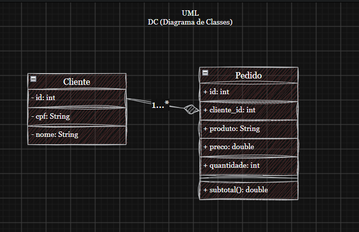

# Pedidos Back-End MVC DC
Back-end com duas coleções mockup JSON clientes e pedidos, CRUD, para aprender, MVC e UML Diagrama de Classes.

## Diagrama


## Tecnologias
- Node.js
- VsCode (Thunder Client)
- JavaScript
- MVC

## Passos para testar
- Clone este repositório e abra com o VsCode
- Instale as depenências e execute com os seguintes comandos no terminal:
```bash
npm install
npm run dev
```